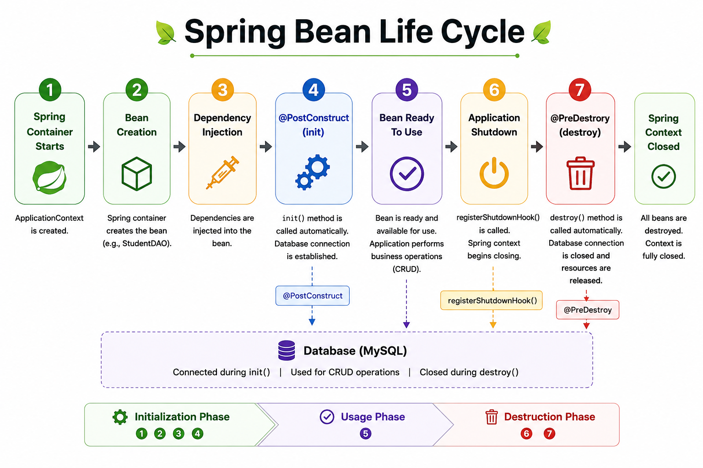

# 🚀 Spring Bean Life Cycle

A practical implementation of Spring Bean Life Cycle management using annotations and JDBC operations.

---
## ⚙️ What This Covers

✔ Spring Bean Life Cycle Management  
✔ Bean Initialization & Destruction  
✔ Annotation-Based Configuration   
✔ Automatic Resource Management  
✔ Spring Context Shutdown Handling  
✔ Database Connection Setup & Cleanup

---

## 🛠️ How It Works

| Annotation / Feature | Description |
|-------------------|-------------|
| `@PostConstruct` | Executes initialization logic after bean creation |
| `@PreDestroy` | Executes cleanup logic before bean destruction |
| `registerShutdownHook()` | Automatically closes the Spring context |
| StudentDAO | Handles JDBC CRUD database operations |
| Spring Container | Creates, manages, and destroys beans |

---

## 🎯 Conclusion

👉*This repository provides a practical understanding of Spring Bean Life Cycle management and demonstrates how Spring simplifies resource handling, bean initialization, and cleanup using lifecycle annotations.*

---

⭐ Thank You for Visiting This Repository ⭐

